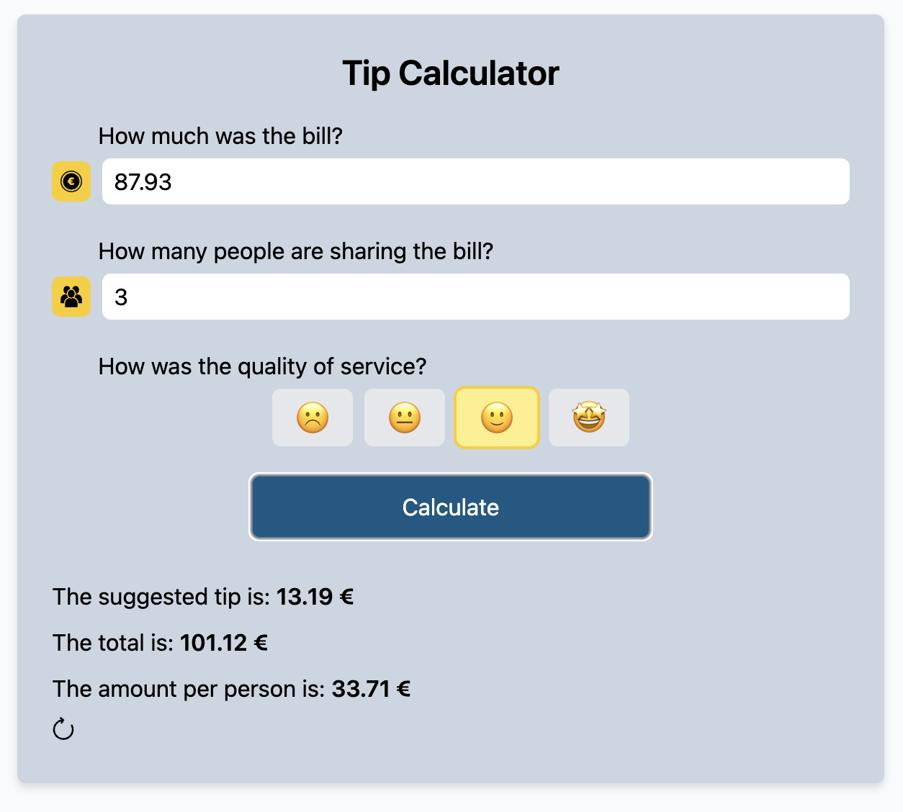
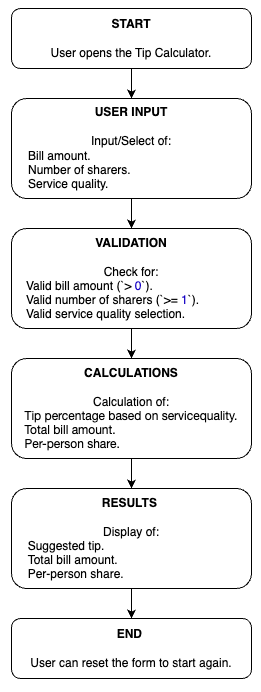

# Project - Tip Calculator 💰🧮



The Tip Calculator is a user-friendly web application designed to calculate the tip amount, total bill, and split it among multiple people based on the service quality. It features a clean interface, responsive design, and dynamic functionality for a seamless user experience.

This project was developed as part of my Web Development Bootcamp.

---

## Table of Contents 📑

- [About](#about)
- [Tech Stack](#tech-stack)
- [Getting Started](#getting-started)
  - [Prerequisites](#prerequisites)
  - [Installation](#installation)
- [Design](#design)
  - [Logic Flow](#logic-flow)

---

## About

The Tip Calculator calculates:

- The suggested tip based on service quality.
- The total bill amount including the tip.
- The amount each person owes when splitting the bill.

It includes:

- Real-time input validation for fields like bill amount, number of sharers, and service quality.
- A responsive layout.
- Dynamic feedback to display results.

---

## Tech Stack

**Markup:**

- HTML5

**Styling:**

- Tailwind CSS

**Interactivity:**

- TypeScript

**IDE:**

- Visual Studio Code

**Version Control:**

- Git & GitHub

---

## Getting Started

Follow these steps to set up and run the project locally:

### Prerequisites

Ensure you have the following installed:

- Git
- Node.js
- A modern browser (Chrome, Edge, etc.)
- Visual Studio Code

### Installation

1.  Clone the repository:

    ```bash
    git clone https://github.com/jutuli/TipCalculator.git
    ```

2.  Install dependencies:
    npm install

3.  Start the development server:
    npm run dev

## Design

The Tip Calculator features:

- A minimalistic layout with clear input fields and a prominent results section.
- A responsive design optimized for both desktop and mobile views.
- Interactive elements styled using Tailwind CSS.

### Logic Flow

The following flowchart outlines the application's core logic:
<br>

